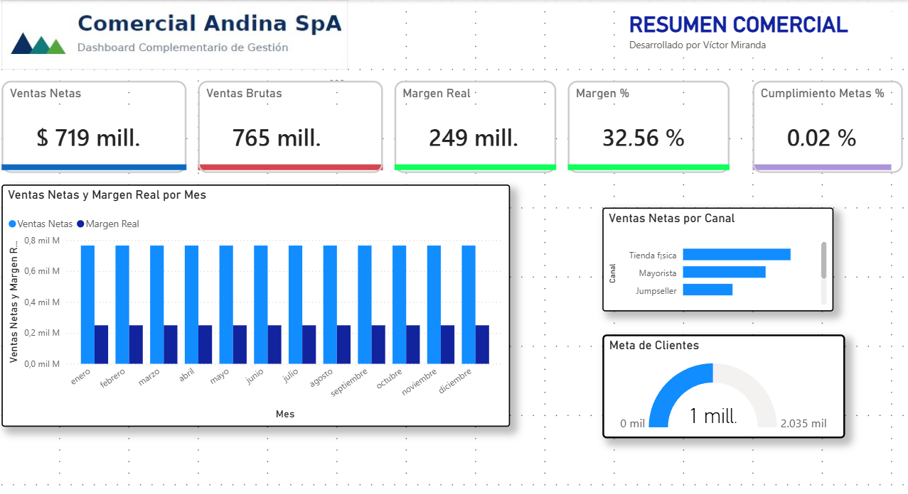
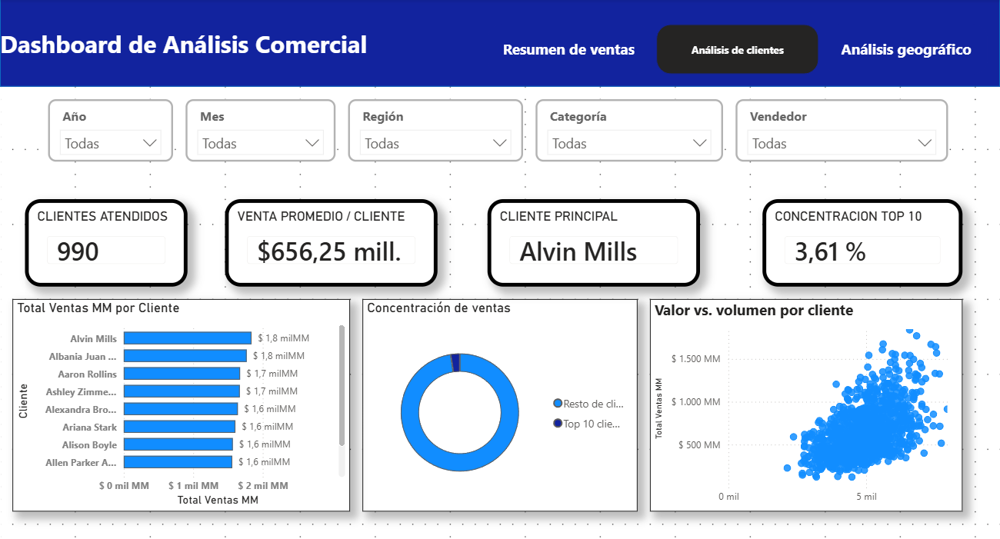
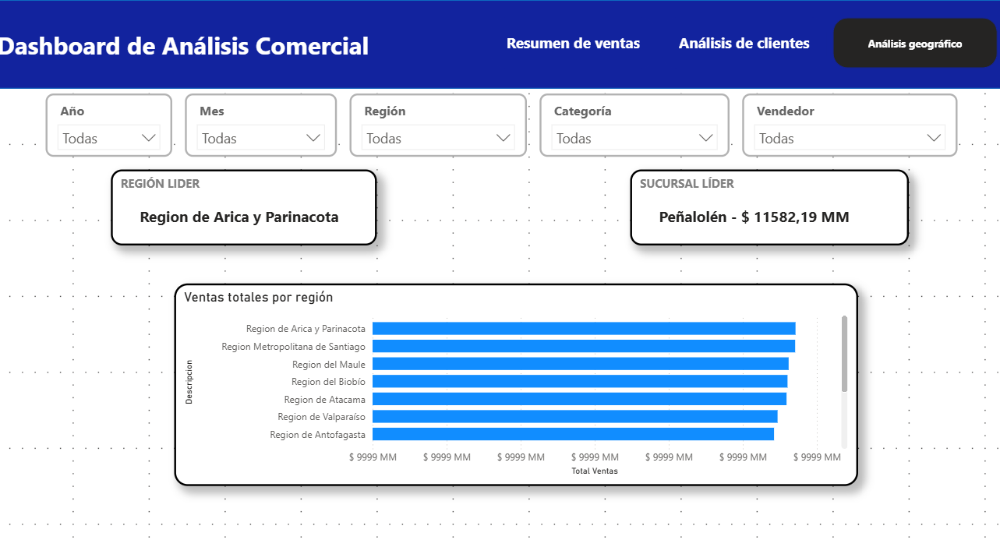
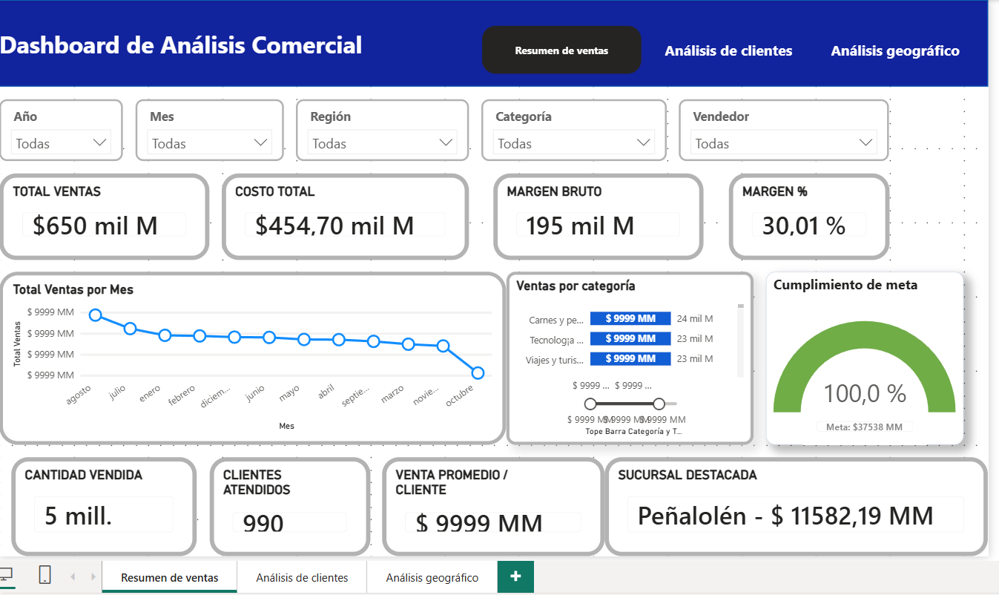

# Hola, soy Víctor Miranda 👋

## Ingeniero de Datos | Analista de Datos | Business Intelligence

Profesional del área informática con amplia experiencia en integración, transformación, análisis y visualización de datos. He participado en proyectos para los sectores bancario y financiero, desarrollando procesos de datos, reportes regulatorios, soluciones ETL, indicadores de gestión y dashboards orientados a apoyar la toma de decisiones.

Actualmente me enfoco en proyectos de Ingeniería de Datos, análisis de información y soluciones de Business Intelligence para empresas y PYMEs.

## Áreas de experiencia

- Ingeniería, integración y transformación de datos.
- Desarrollo y mantenimiento de procesos ETL.
- Análisis, depuración y validación de información.
- Creación de dashboards e indicadores de gestión.
- Modelamiento de datos y reportería.
- Automatización de procesos.
- Soporte técnico y funcional a usuarios.
- Documentación y levantamiento de requerimientos.

## Tecnologías y herramientas

### Datos y programación

- SQL Server, Oracle, Informix y Netezza.
- SQL, T-SQL, HQL y Python.
- Hadoop, Hive, Spark y Scala.
- Azure Databricks y Azure Data Explorer.

### Business Intelligence

- Power BI.
- Power Query.
- DAX.
- Modelamiento dimensional.
- Excel.
- Diseño de KPI y reportes ejecutivos.

### Integración y gestión

- SSIS y DataStage.
- Control-M.
- GitHub y GitLab.
- Jira y ServiceNow.
- Metodologías Scrum y Kanban.

## Proyecto destacado

### Dashboard Comercial para PYMEs – Power BI

Solución de Business Intelligence desarrollada para analizar ventas, rentabilidad, clientes, canales, sucursales y regiones.

El proyecto incluye:

- Dashboard interactivo en Power BI.
- Indicadores comerciales y financieros.
- Análisis de clientes y concentración de ventas.
- Análisis geográfico.
- Archivo PBIX.
- Documentación técnica.
- Imágenes y video demostrativo.

[Ver proyecto Dashboard Comercial para PYMEs](https://github.com/vitoco888/dashboard-comercial-pymes-power-bi)

## Experiencia sectorial

He participado principalmente en proyectos relacionados con:

- Banca y servicios financieros.
- Factoring.
- Información regulatoria.
- Inteligencia de negocios.
- Procesamiento de grandes volúmenes de datos.
- Automatización y control de procesos.

## Servicios para empresas y PYMEs

Desarrollo soluciones de análisis de datos que consideran:

- Integración de información desde Excel, CSV, bases de datos y sistemas empresariales.
- Limpieza y transformación de datos.
- Creación de modelos e indicadores.
- Desarrollo de dashboards en Power BI.
- Automatización de reportes.
- Documentación y apoyo a usuarios.

## Objetivo profesional

Continuar aportando mi experiencia en proyectos de Ingeniería de Datos, análisis y Business Intelligence, ayudando a transformar información en soluciones confiables que faciliten la gestión y la toma de decisiones.

## Contacto

- GitHub: [vitoco888](https://github.com/vitoco888)
- LinkedIn: linkedin.com/in/victormiranda
- Correo profesional: vitoco888@gmail.com

==============================================================================================================================================================

# Dashboard Comercial para PYMEs – Power BI

## Descripción

Proyecto de Business Intelligence desarrollado en Power BI para apoyar el seguimiento y análisis comercial de pequeñas y medianas empresas.

El dashboard centraliza información relacionada con ventas, rentabilidad, clientes, canales, sucursales y regiones, transformándola en indicadores y visualizaciones interactivas que facilitan la toma de decisiones.

## Objetivo del proyecto

Proporcionar una visión clara del desempeño comercial de la empresa, permitiendo:

* Controlar las ventas y los costos.
* Evaluar el margen y la rentabilidad.
* Medir el cumplimiento de metas.
* Identificar clientes y sucursales destacadas.
* Analizar la distribución geográfica de las ventas.
* Detectar tendencias y oportunidades comerciales.

## Vista del dashboard

### 1. Resumen comercial

Vista ejecutiva de ventas netas, ventas brutas, margen real, cumplimiento de metas, ventas por canal y evolución mensual.

### 2. Análisis de clientes

Permite analizar clientes atendidos, venta promedio, cliente principal, concentración Top 10 y relación entre valor y volumen de compra.

### 3. Análisis geográfico

Presenta las ventas por región y sucursal, permitiendo identificar la región líder y las sucursales con mejor desempeño.

### 4. Resumen de ventas

Muestra ventas totales, costos, margen bruto, cantidad vendida, categorías y cumplimiento de objetivos comerciales.

## Páginas desarrolladas

### Resumen comercial

Presenta una visión ejecutiva de las ventas netas, ventas brutas, margen real, margen porcentual, cumplimiento de metas, ventas por canal y evolución mensual.

### Resumen de ventas

Permite analizar el total de ventas, costo total, margen bruto, cantidad vendida, ventas por categoría, clientes atendidos y sucursal destacada.

### Análisis de clientes

Incluye indicadores como clientes atendidos, venta promedio por cliente, cliente principal, concentración de ventas Top 10 y análisis de valor versus volumen.

### Análisis geográfico

Permite comparar las ventas por región y sucursal, identificando la región líder y la sucursal con mejor desempeño.

## Principales indicadores

* Ventas netas y ventas brutas.
* Total de ventas y costo total.
* Margen real y margen porcentual.
* Cumplimiento de metas.
* Cantidad vendida.
* Clientes atendidos.
* Venta promedio por cliente.
* Cliente principal.
* Concentración de ventas Top 10.
* Ventas por canal y categoría.
* Región líder.
* Sucursal destacada.

## Tecnologías utilizadas

* Power BI Desktop.
* Power Query.
* Lenguaje DAX.
* Modelamiento dimensional.
* Relaciones entre tablas.
* Archivos Excel y CSV.
* Visualizaciones e indicadores KPI.

## Estructura del proyecto

* `Documentacion`: ficha técnica y descripción del proyecto.
* `Imagenes`: capturas de las páginas del dashboard.
* `PBIX`: archivo desarrollado en Power BI.
* `Video`: demostración del funcionamiento del dashboard.

## Archivos principales

* [Ficha del proyecto](Documentacion/Ficha_Proyecto_Dashboard_Comercial_PYMEs.pdf)
* [Archivo Power BI](PBIX/Dashboard_Comercial_PYMEs.pbix)
* [▶ Ver 01_Resumen_comercial.mp4](https://drive.google.com/file/d/1zwDVdLUs--QsgAyNRqjHhQWP36iGian_/view?usp=drive_link)
* [▶ Ver 02_Analisis_Clientes.mp4](https://drive.google.com/file/d/17WWe2gXsM41KZAJjPtSlZOxV0CwlfujV/view?usp=drive_link)
* [▶ Ver 03_Analisis_Geografico.mp4](https://drive.google.com/file/d/1xxFXL50tUliZI76o9kPlbNLgGpeJDXs5/view?usp=drive_link)
* [▶ Ver 04_Resumen_ventas.mp4](https://drive.google.com/file/d/1dPDYvJkPi4LnmR-9wh3ZmD55MOxba-nG/view?usp=drive_link)

## Datos utilizados

Los datos utilizados en este proyecto son ficticios y fueron generados exclusivamente con fines demostrativos. No contienen información personal, financiera ni comercial de empresas reales.

## Autor

**Víctor Miranda**
Ingeniero de Datos | Analista de Datos y Business Intelligence

Experiencia en integración, transformación, análisis y visualización de datos mediante SQL, Power BI, procesos ETL y herramientas del ecosistema Microsoft.
